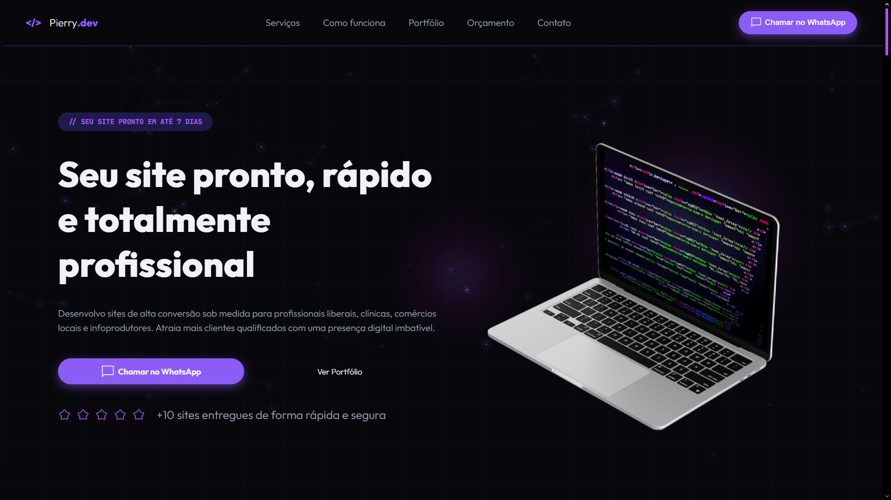

# 💻 pierry.com.br

<p align="center">
  <a href="https://pierry.com.br">
    
  </a>
</p>

<p align="center">
  Landing page responsiva para divulgação de serviços de desenvolvimento web, criada para apresentar soluções, processo de trabalho, portfólio e canais de contato.
</p>

<p align="center">
  Demonstração: 
  <a href="https://pierry.com.br"><strong>🔗pierry.com.br</strong></a>
</p>

## 💭 Sobre o projeto

Esta é a página institucional da **Pierry.dev**, voltada a profissionais liberais, clínicas, comércios locais, infoprodutores e outros negócios que precisam fortalecer a presença digital. O site conduz o visitante da proposta de valor ao contato pelo WhatsApp, com uma estrutura pensada para apresentar serviços e gerar pedidos de orçamento.

## 🚀 Funcionalidades

- Navegação por âncoras entre as seções da página e menu adaptado para dispositivos móveis.
- CTAs de contato integrados ao WhatsApp.
- Catálogo de serviços com prévias exibidas em modal.
- Seção de processo em quatro etapas: alinhamento, proposta, design e entrega.
- Portfólio em carrossel com links para projetos publicados.
- FAQ interativo com dúvidas recorrentes sobre prazos, pagamento, revisões, domínio e hospedagem.
- Layout responsivo para desktop e mobile.
- Rolagem suave com **Lenis**.
- Animações visuais feitas com **p5.js** e efeitos guiados pelo progresso da rolagem (*scroll-driven animations*).
- Rodapé com e-mail, WhatsApp e atalhos de navegação.

## ⚙ Tecnologias utilizadas

- **Vite** como ferramenta de desenvolvimento e build.
- **HTML5** para a estrutura semântica da página.
- **SCSS** para estilização, organização dos estilos e responsividade.
- **TypeScript** para os comportamentos do menu, serviços, portfólio e FAQ.
- **Lenis** para a rolagem suave.
- **p5.js** para animações visuais.
- **Scroll-driven animations** para efeitos acionados pelo progresso da rolagem.
- **Google Fonts**: [Outfit](https://fonts.google.com/specimen/Outfit) e [JetBrains Mono](https://fonts.google.com/specimen/JetBrains+Mono).

## 🔨 Estrutura esperada

```text
.
├── index.html
└── src/
    ├── assets/
    │   └── images/
    │       ├── hero/
    │       ├── icons/
    │       ├── projects/
    │       └── services/
    └── scripts/
        ├── aside_menu.ts
        ├── faq.ts
        ├── main.ts
        ├── portfolio.ts
        └── service.ts
```

## 💾 Como executar localmente

O projeto utiliza Vite. Instale as dependências e inicie o servidor de desenvolvimento:

```bash
npm install
npm run dev
```

Depois, abra no navegador a URL exibida pelo servidor local.

## 💼 Serviços apresentados

- Sites institucionais
- Portfólios online
- Linktrees personalizados
- Currículos digitais
- Landing pages
- Páginas de vendas
- Páginas de aniversário
- Páginas de eventos

## ✉ Contato

- Site: [pierry.com.br](https://pierry.com.br)
- WhatsApp: [(11) 97483-8207](https://wa.me/5511974838207)
- E-mail: [pierry.savio.dev@gmail.com](mailto:pierry.savio.dev@gmail.com)

---

Desenvolvido por [Pierry Savio](https://pierry.com.br).
